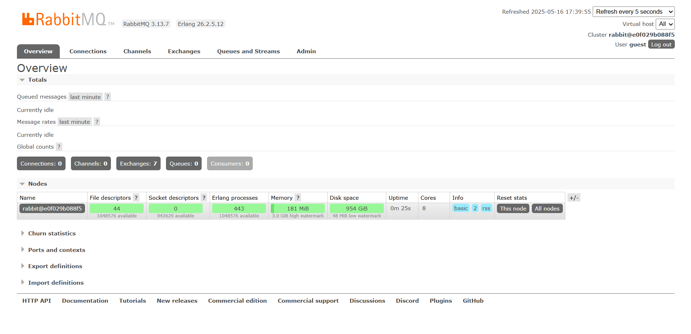
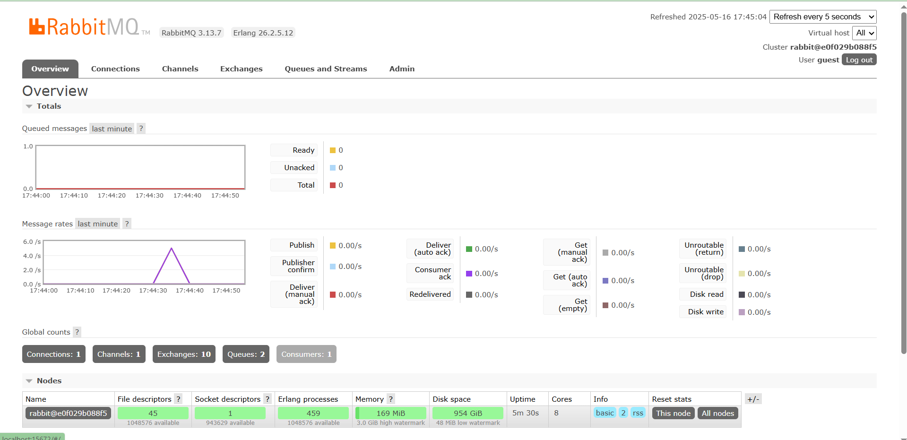

### a. How much data will the publisher program send to the message broker in one execution?

In a single run, the publisher sends five messages, each containing a UserCreatedEventMessage struct with two string fields: user\_id and user\_name. These messages are serialized using Borsh, a compact binary serialization format. For each message, the user\_id field, such as "1", takes about 5 bytes, including 1 byte for the character and 4 bytes for the length prefix added by Borsh. The user\_name field, for example "2306256444-Amir", takes around 19 bytes, composed of 15 bytes for the string content and 4 bytes for the prefix. This brings the total size of each message to approximately 24 bytes. When multiplied by five messages, the program sends roughly 120 bytes of raw serialized data to the message broker, not including protocol overhead or headers.

### b. What does the URL “amqp\://guest\:guest\@localhost:5672” represent in both programs?

The URL amqp\://guest\:guest\@localhost:5672 shows that both the publisher and the subscriber are configured to connect to the same message broker. This broker is running on the local machine, as indicated by localhost, and listens on the default AMQP port 5672. The connection uses the default credentials guest for both the username and the password. Using this configuration, both components of the system can interact with the same broker instance where the publisher sends events and the subscriber listens for and processes them, ensuring they operate within the same messaging environment.

## RABBITMQ

## RABBITMQ AFTER RUN

When the cargo run command is executed on the publisher, it sends 5 UserCreatedEventMessage events to the RabbitMQ message broker. These messages are then immediately received and processed by the subscriber, as reflected in the short spike in the message rate graph on the RabbitMQ dashboard.